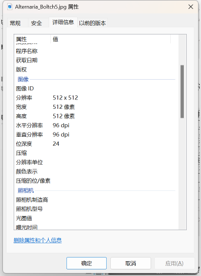

# Apple Leaf Disease Image Classification Dataset

**Complete Dataset Introduction:**
- In the folder "Health," there are 1645 images.
- In the folder "Spotted Falling Blight," there are 411 images.
- In the folder "Grey Spotting Blight," there are 370 images.
- In the folder "Covered with Leaves," there are 375 images.
- In the folder "Brown Spotting Blight," there are 435 images.
- In the folder "Rust," there are 713 images.
- In the folder "Black Spotting Blight," there are 630 images.
- In the folder "Black Rot," there are 621 images.

The total number of images in all subfolders is 5200.

**Overall Screenshot:**

**Examples of Images from the Dataset:**

**Image Resolution:**

**Number of Images in Each Subfolder:**

## Images

Here is a pay link on Stripe ( https://buy.stripe.com/3cs8yP7sY87d0vu9AB ). Please contact me lonlonago@foxmail.com after funding $89, and I will send you a complete data files , thank you!

